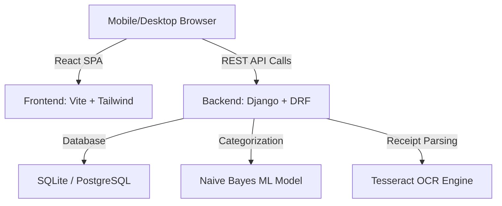

# ⚡ Flux - Advanced Personal Finance & Budget Management System

Flux is a comprehensive, self-hosted personal finance tracker and budget management platform. It features an automated Django REST API backend coupled with an interactive, premium React dashboard, integrated with Naive Bayes AI transaction categorization and OCR receipt scanning.

---

## 🏗️ Architecture Overview

Flux is designed as a clean monorepo:



- **`backend/`**: Django, Django REST Framework (DRF), SimpleJWT (Auth), Spectacular (OpenAPI 3 / Swagger), WhiteNoise, and Pytesseract.
- **`frontend/`**: Vite + React, Tailwind CSS, Recharts (Analytics), and Progressive Web App (PWA) support.

---

## ✨ Features

### 1. 💼 Account & Wallet Management
* Create and manage multiple financial accounts/wallets (Bank, Cash, Digital Wallet, Credit Card).
* Transactions can be associated with specific accounts to maintain accurate ledgers.
* Localized support for **INR (₹)**.

### 2. 📅 Recurring Transactions
* Configure automatic transaction schedules (Daily, Weekly, Monthly, Yearly).
* Running due schedules via:
  - **API Endpoint**: `POST /api/recurring-transactions/run_due/`
  - **Django Management Command**: 
    ```bash
    python manage.py process_recurring_transactions --as-of 2026-02-20
    ```

### 3. 🎯 Financial Goals & Savings Trackers
* Create target savings goals with progress meters.
* Contributed funds to goals directly through the dashboard via `POST /api/goals/{id}/contribute/`.

### 4. 🧠 AI Transaction Categorization & OCR Ingestion
* **Naive Bayes Classifier**: Learns from your transaction history and user feedback to automatically categorize transaction descriptions.
* **Receipt OCR Parsing**: Extract transaction amount, date, and suggested category from uploaded receipts/images using Tesseract OCR.
* **Retraining Loop**: Trigger model retraining manually via endpoint or periodically through management commands.

### 5. 🔒 Enterprise-Grade Security
* **JWT Authentication**: Login via JWT access/refresh tokens with rotation and blacklisting.
* **Email Verification**: User registration requires OTP email verification with robust rate-limiting and lockout configurations.
* **Rate Limiting (Throttling)**: API rate-limiting for auth-sensitive endpoints to prevent brute-force attacks.

### 6. 📱 PWA Support & Mobile-Friendly Layout
* Installable on iOS/Android devices as a PWA.
* Fully responsive, beautiful interface with premium dark/light mode styles and visual micro-animations.
* Branded with **HS Builds** auth watermarks.

---

## 🚀 Quick Start Guide

### Prerequisites
* **Python 3.14+**
* **Node.js 24+**
* **Tesseract OCR** (Required for receipt scanning features)

---

### Local Installation

#### 1. Clone the Repository
```bash
git clone https://github.com/HemanthSushi/MoneyDiary.git
cd expense-tracker
```

#### 2. Backend Setup
Create a virtual environment, install packages, run database migrations, and optionally create a superuser:
```bash
cd backend
python -m venv venv
venv\Scripts\activate      # On Windows (cmd)
source venv/bin/activate   # On Linux/macOS
pip install -r requirements.txt
python manage.py migrate
python manage.py createsuperuser
```
> [!NOTE]
> Copy `backend/.env.example` to `backend/.env` and configure your secret keys and SMTP settings.

#### 3. Frontend Setup
Install frontend dependencies:
```bash
cd ../frontend
npm install
```
> [!NOTE]
> Copy `frontend/.env.example` to `frontend/.env` and update `VITE_API_BASE_URL` with your local IP address or backend domain.

---

### Running the Application

#### Option 1: Automated Start (Windows)
Double-click `start.bat` in the root folder, or run:
```bash
.\start.bat
```
This automatically launches the backend and frontend dev servers in separate command prompt windows.

#### Option 2: Manual Start

**Start Backend Server** (in terminal 1):
```bash
cd backend
venv\Scripts\activate
python manage.py runserver 0.0.0.0:8000
```

**Start Frontend Dev Server** (in terminal 2):
```bash
cd frontend
npm run dev -- --host 0.0.0.0
```

---

## 📱 Mobile Browser Access

To run the application and connect from your mobile browser (PWA mode):
1. **Find your local IP address** by running `ipconfig` (Windows) or `ifconfig` (Linux/macOS). Let's assume it is `192.168.1.100`.
2. Edit your [frontend/.env](file:///d:/expense-tracker/frontend/.env) file:
   ```env
   VITE_API_BASE_URL=http://192.168.1.100:8000/api
   ```
3. Restart the frontend server.
4. On your mobile browser, navigate to: `http://192.168.1.100:5173`

---

## 🛠️ API & Development Documentation

### Interactive API Explorer
* **Swagger UI Docs**: [http://localhost:8000/api/docs/swagger/](http://localhost:8000/api/docs/swagger/)
* **ReDoc Docs**: [http://localhost:8000/api/docs/redoc/](http://localhost:8000/api/docs/redoc/)

### AI & OCR Endpoints
* **Category Prediction**: `POST /api/ai/categorize/`
* **Model Retraining**: `POST /api/ai/retrain/`
* **Receipt Upload Ingestion**: `POST /api/ai/receipt/ingest/`

---

## 🧪 Testing & Diagnostics

* Run backend unit tests:
  ```bash
  cd backend
  python manage.py test
  ```
* Run SMTP diagnostics locally: If verification emails fail to deliver, verify the `email_error` and `debug_otp` fields in the response. By default, when `DEBUG=True` and `EMAIL_DEV_EXPOSE_OTP=True`, verification OTPs are exposed in the JSON response payload for easy testing.

---

## 🚀 Production Deployment

### Django serving built SPA Assets
To compile and test the production bundle locally:
1. Run build in frontend:
   ```bash
   cd frontend
   npm run build
   ```
2. Sync the built template and static assets into the Django backend:
   ```bash
   npm run build:sync
   ```
3. Run the backend server with `DEBUG=False` to serve the static frontend bundle:
   ```bash
   cd ../backend
   python manage.py collectstatic --noinput
   python manage.py runserver
   ```
For detailed hosting setup instructions (Vercel for Django API + Netlify for Vite React), refer to the [Vercel & Netlify Deploy Guide](file:///d:/expense-tracker/docs/deploy-vercel-netlify.md).
